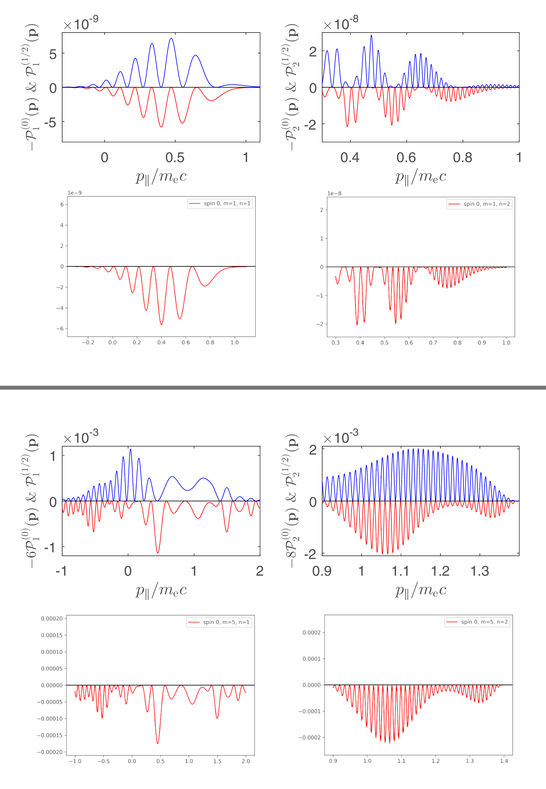
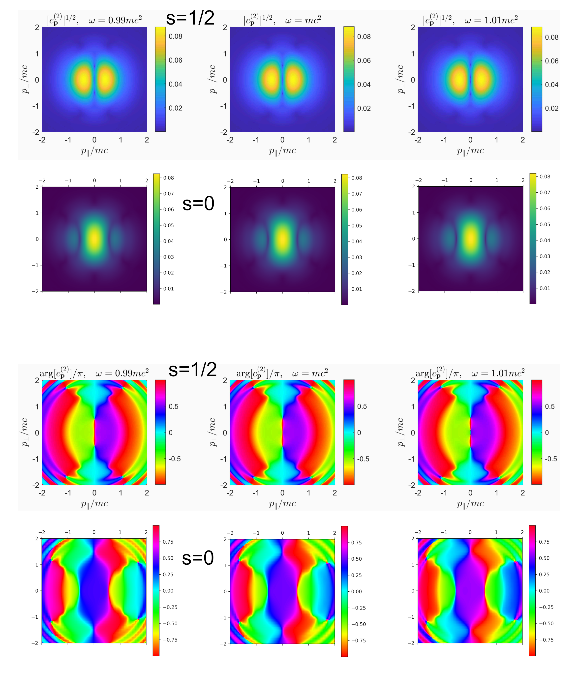
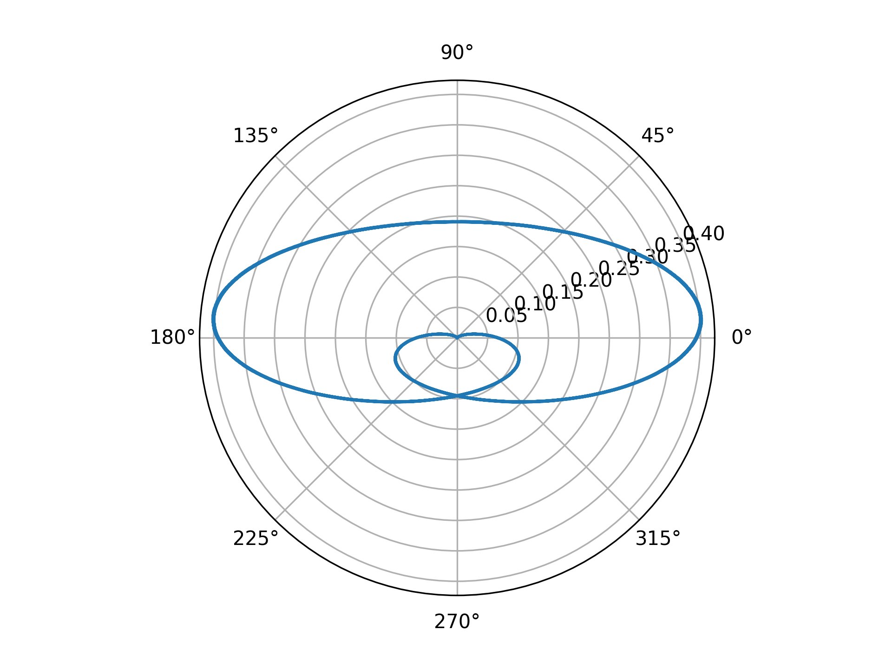
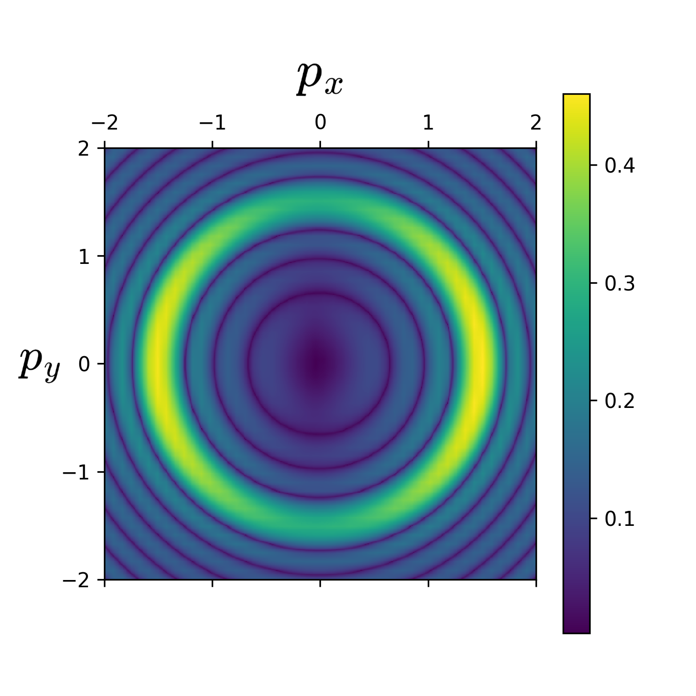
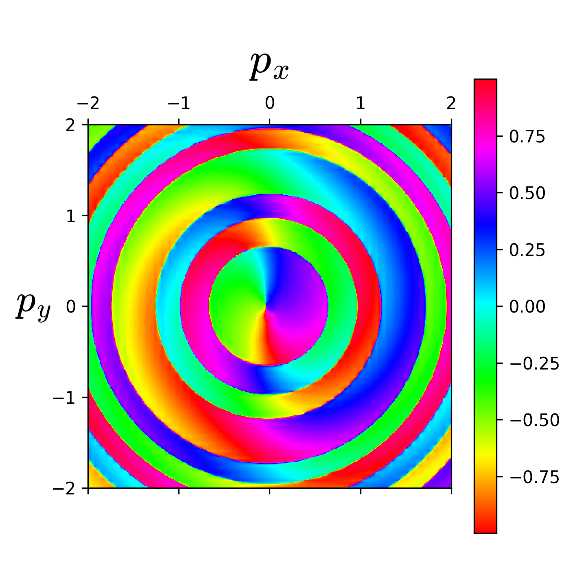
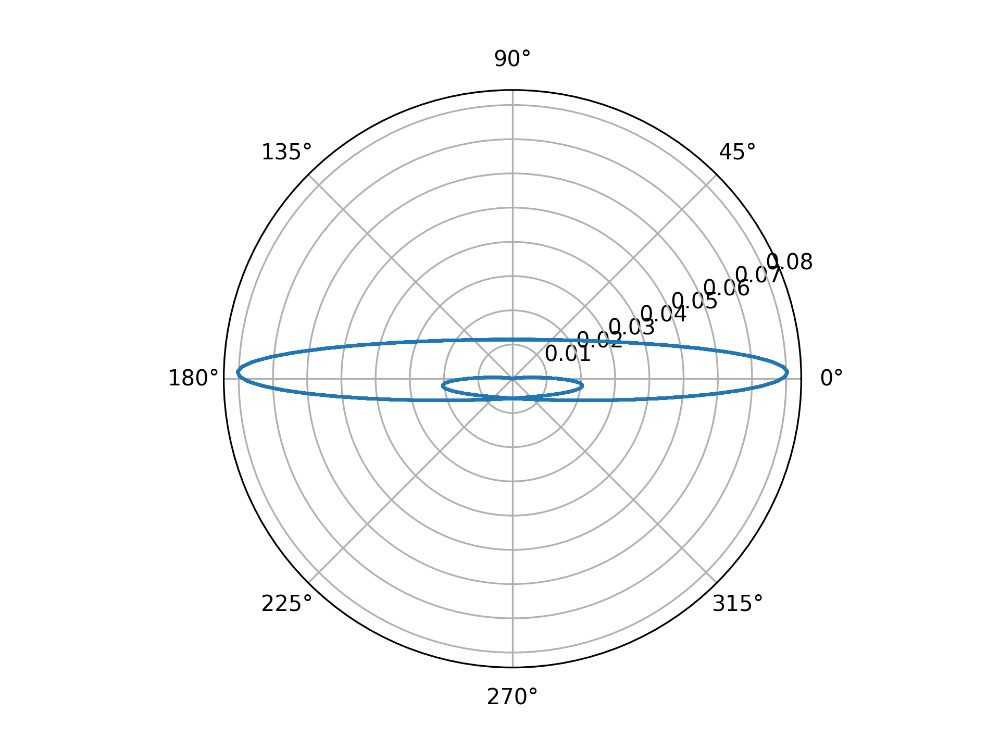
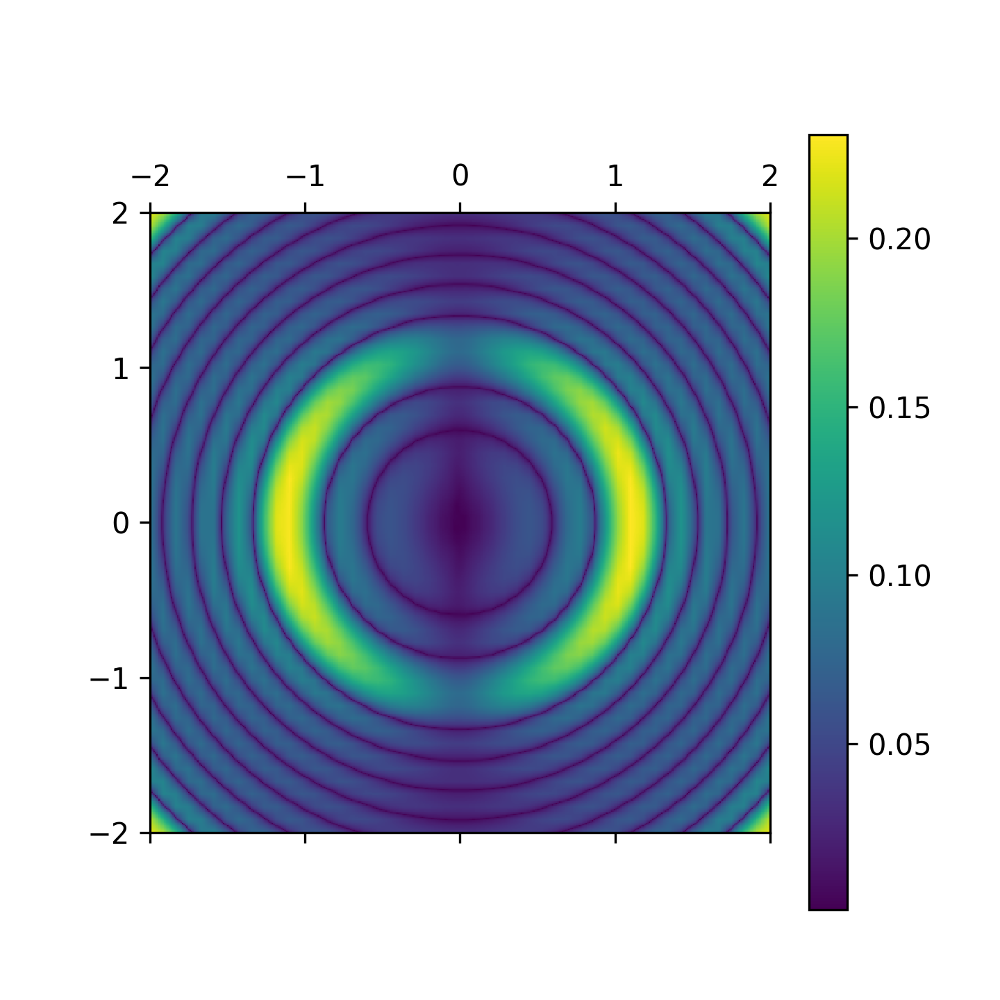
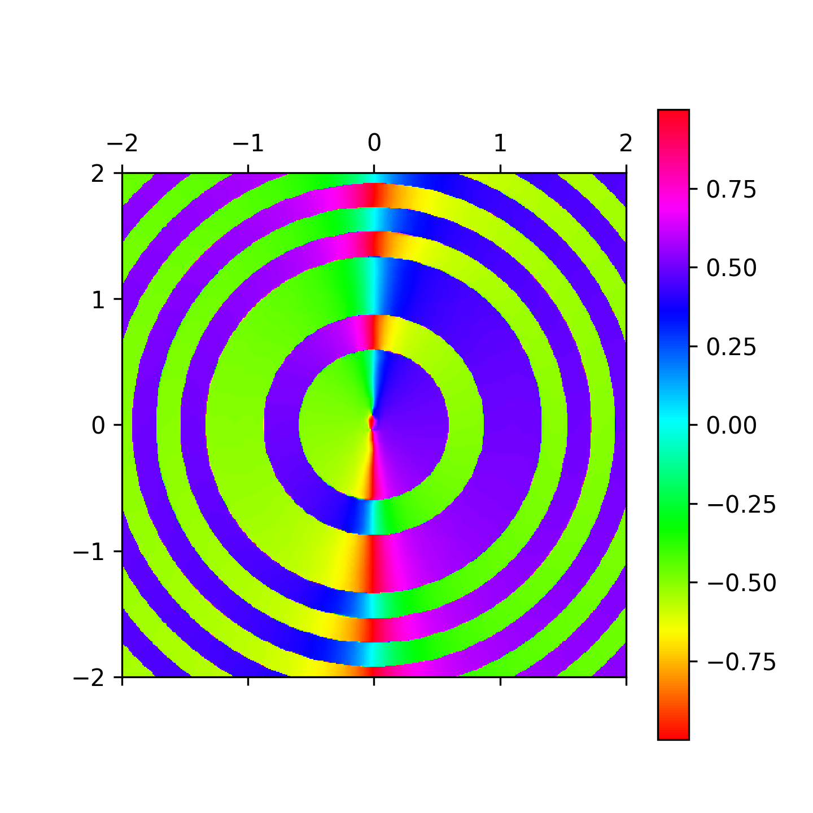

# Schwinger pair production in the extremely powerful laser light for the scalar electrodynamics

The reference for this project is the article by *Krajewska, K., & Kamiński, J. Z. (2019). Unitary versus pseudounitary time evolution and statistical effects in the dynamical Sauter-Schwinger process. Physical Review. A/Physical Review, A, 100(6). https://doi.org/10.1103/physreva.100.062116*. 
The goal is to first validate the code for the Schwinger pairs momentum distribution for bosonic matter and linearly polarized light, and then implement the arbitrary polarization and study 2D momentum distributions along with possible vortex structures. This would allow for comparison with the spin 1/2 electrons and determining what effects are introduced by a spin, and what are inherent to the Schwinger process itself. 
**Work in progess**.

I try to first reproduce the results for the bosonic field and the light with linear polarization. The comparison with fig. 5. from the cited article and the results generated by my code are identical, as they should be. The top rows are taken from the article, while the bottom ones are my results.

I performed simulations of the two-dimensional momentum distribution of linearly polarized light for the parameters and form of the field from the article *Bechler, Velez, Krajewska, Kaminski (2023)*. Here the diagrams from fig. 2. of this article for electrons and my results for spin 0. For these parameters in the case of spin 0 there are no vortices and no vortex merging occur. Again the top rows are taken from the article and the bottom ones are my results.

Finally, for bosons, after a slight modification, the effect of a field with time-dependent polarization can be simulated by the same method. I assumed the following form of the field:
$$\vec{\mathcal{E}}(t) = \begin{cases} \mathcal{E}_0 \begin{pmatrix}\sin^2(n_{\text{rep}}\omega t/2)\cos(n_{\text{rep}}n_{\text{osc}}\omega t+\chi)\cos(\delta) \\ \sigma \sin^2(n_{\text{rep}}\omega t/2)\sin(n_{\text{rep}}n_{\text{osc}}\omega t+\chi)\sin(\delta) \end{pmatrix} \ \text{if} \ \ 0 < \omega t < 2\pi n_\text{rep} \\ 0 \qquad \text{else} \end{cases}$$ 
Where $n_{\text{rep}}$ is the number of repetitions of the pulse, and $n_{\text{osc}}$ is the number of oscillations in a repetition.
The field of any time-dependent polarity can be represented on a graph in polar coordinates $r(\phi) = |\vec{\mathcal{E}}| \left(\arg(\vec{\mathcal{E}})\right)$. Below is a plot of the pulse waveform and momentum distribution for the parameters:
$$\mathcal{E}_0 = 0.5  \frac{m_e^2 c^3}{e}, \ \omega = 1.2 m_ec^2, \ n_\text{rep} = 3, \ n_\text{osc}=2, \ \chi = \frac{\pi}{2}, \ \sigma = 1, \ \delta = \frac{\pi}{8}$$
Here I adopt the convention from the article *Kaminski, Krajewska (2019)*, where in analytical expressions $\hbar = 1$, while in numerical simulations $m = m_e = c = h = 1$.
In addition, in the diagram below $e=1$, so that the dimensionless amplitude denotes the fraction of the critical Schwinger field strength $\mathcal{E}_S = \frac{m_e^2 c^3}{e}$.

Amplitude of the momentum distribution:

Phase of the momentum distribution:

Analogous graphs for modified parameters $\mathcal{E}_0 = 0.1 \mathcal{E}_S, \ \omega = m_e c^2, \  \sigma = 0.3$ (other parameters left unchanged):

The next step will be improving code efficiency by implementing differential equation solver in cython or JIT compiler Numba, so that the resolution can be significantly enhanced and different field parameters can be studied in a reasonable execution time.
